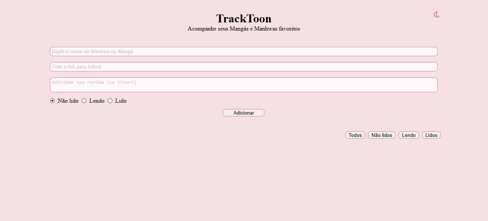
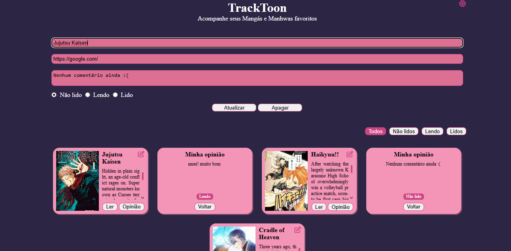
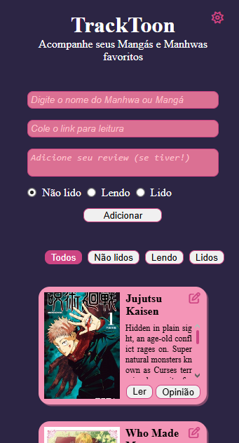

# 📚 TrackToon

**TrackToon** é uma aplicação CRUD desenvolvida para acompanhar o progresso de leitura de Mangás e Manhwas de forma simples e visual.  
O projeto utiliza a **API Jikan** para buscar automaticamente informações como capa, título completo e sinopse das obras.

---

### ✨ Funcionalidades

- ✅ Adicionar mangás/manhwas à lista  
- 🔍 Busca automática via API Jikan  
- 📝 Adicionar review pessoal  
- 📊 Marcar status de leitura:
  - Não lido
  - Lendo
  - Lido
- 🎨 Alternância entre tema claro e escuro  
- 🔄 Editar itens existentes  
- 🗑️ Remover itens  
- 💾 Persistência de dados com LocalStorage  
- 🧩 Filtro por status de leitura  
- 🔁 Card com efeito flip para visualizar opinião

---

### 🛠️ Tecnologias Utilizadas

- HTML5  
- CSS3  
- JavaScript (Vanilla)  
- API Jikan  
- Font Awesome  

---

### 📁 Estrutura do Projeto

```

TrackToon/
│
├── index.html      # Estrutura da aplicação
├── style.css       # Estilização e temas
├── script.js       # Lógica CRUD e integração com API
├── LICENSE         # Licensa MIT da aplicação
└── README.md       # Documentação do projeto

````

---

### 🚀 Como Executar

1. Clone o repositório:

```bash
git clone https://github.com/lelepton/TrackToon.git
````

2. Acesse a pasta do projeto:

```bash
cd tracktoon
```

3. Abra o arquivo `index.html` no navegador.

> Não é necessário servidor — o projeto roda localmente.

---

### 🔌 Integração com a API

O TrackToon utiliza o endpoint de busca da Jikan:

```
https://api.jikan.moe/v4/manga?q={nome}&limit=1
```

A aplicação coleta automaticamente:

* 📕 Título
* 🖼️ Capa
* 📖 Sinopse

---

### 💡 Como Usar

1. Digite o nome do mangá/manhwa
2. Cole o link de leitura
3. (Opcional) escreva sua review
4. Selecione o status de leitura
5. Clique em **Adicionar**

Depois disso você pode:

* Filtrar pelos botões superiores
* Clicar em **Opinião** para virar o card
* Editar ou apagar quando quiser

---

### 📦 Armazenamento

Os dados são salvos no **LocalStorage** do navegador, permitindo que sua lista permaneça mesmo após fechar a página.

---

### 🔮 Possíveis Melhorias Futuras

* 🔐 Sistema de login
* ☁️ Persistência em banco de dados
* ⭐ Sistema de avaliação por estrelas
* 🔎 Busca com múltiplos resultados
* 🏷️ Categorias ou tags

---

### 🎬 Demonstração

🔗 **Acesse aqui:** https://lelepton.github.io/TrackToon/

📸 **Preview:**





### 📄 Licença

Distribuído sob a licença MIT. Veja LICENSE para mais informações.

---

### 👩‍💻 Autoria

Desenvolvido por Letícya Medeiros ✨